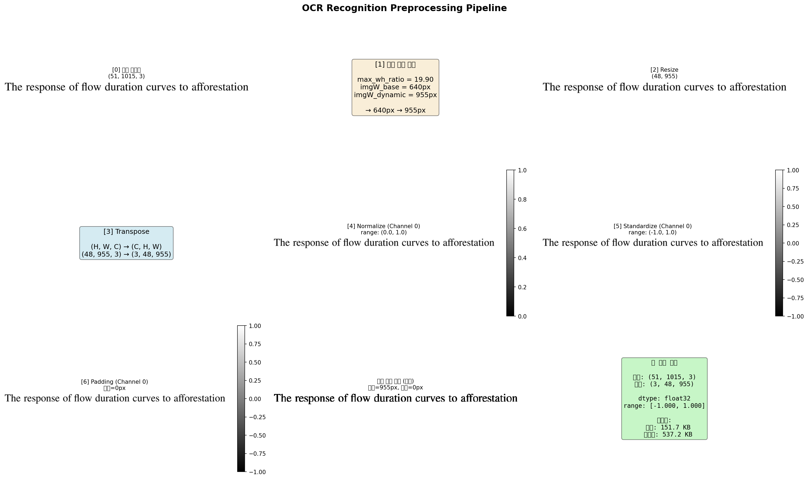

# OCR Recognition Preprocessing 문서

OCR Recognition 모델의 전처리 과정에 대한 상세 분석 문서입니다.

## 📚 문서 목록

### 1. **요약 문서** (빠른 이해용)
- **파일**: [`OCR_REC_PREPROCESSING_SUMMARY.md`](./OCR_REC_PREPROCESSING_SUMMARY.md)
- **내용**: 핵심 내용만 빠르게 파악 (5분 읽기)
- **대상**: 전처리 개요를 빠르게 이해하고 싶은 경우

### 2. **상세 가이드** (완전한 이해용)
- **파일**: [`OCR_REC_PREPROCESSING.md`](./OCR_REC_PREPROCESSING.md)
- **내용**: 전처리 과정의 모든 세부사항 (15분 읽기)
- **대상**: 전처리 로직을 깊이 이해하거나 구현해야 하는 경우

### 3. **시각화 이미지**
- **파일**: [`rec_preprocessing_visualization.png`](./rec_preprocessing_visualization.png)
- **내용**: 6단계 전처리 과정을 시각적으로 표현
- **대상**: 전처리 흐름을 직관적으로 이해하고 싶은 경우



---

## 🚀 시작하기

### 1️⃣ 빠른 이해 (5분)
```bash
# 요약 문서 읽기
cat docs/OCR_REC_PREPROCESSING_SUMMARY.md
```

### 2️⃣ 시각화 생성 (테스트)
```bash
# 직접 시각화 생성해보기
python tools/visualize_rec_preprocessing.py \
    --image demo/output-offline/demo1/rec_inputs/page000_region0015_cat15.jpg \
    --output my_visualization.png
```

### 3️⃣ 상세 학습 (15분)
```bash
# 상세 가이드 읽기
cat docs/OCR_REC_PREPROCESSING.md
```

---

## 🎯 핵심 내용 (30초 요약)

OCR Recognition 전처리는 **6단계**:

1. **동적 너비 계산**: 메모리 최적화 (최대 50% 절감)
2. **Resize**: 높이 48px 고정, aspect ratio 유지
3. **Transpose**: (H, W, C) → (C, H, W)
4. **Normalize**: [0, 255] → [0, 1]
5. **Standardize**: mean=0.5, std=0.5 → [-1, 1]
6. **Padding**: 오른쪽에 0으로 패딩

**결과**: `(3, 48, W_dynamic)` 형상, float32, [-1, 1] 범위

---

## 📂 관련 코드

### 구현 파일
- `rapid_doc/model/ocr/dx_ocr.py` - DX Engine 구현
- `value_compare/recognition/onnx_recognition.py` - ONNX 벤치마크

### 시각화 도구
- `tools/visualize_rec_preprocessing.py` - 전처리 시각화 스크립트

---

## 🔍 추가 정보

### 성능 최적화
- **짧은 텍스트**: 메모리 50% 절감 (640px → 320px)
- **긴 텍스트**: 필요시만 확장 (640px → 1000px)
- **배치 크기**: CPU 4-6, GPU 16-32 권장

### 정규화 파라미터
- **mean**: 0.5 (PP-OCRv5 표준)
- **std**: 0.5 (PP-OCRv5 표준)
- **결과 범위**: [-1, 1]

---

**작성일**: 2024-11-18  
**작성자**: AI Assistant
